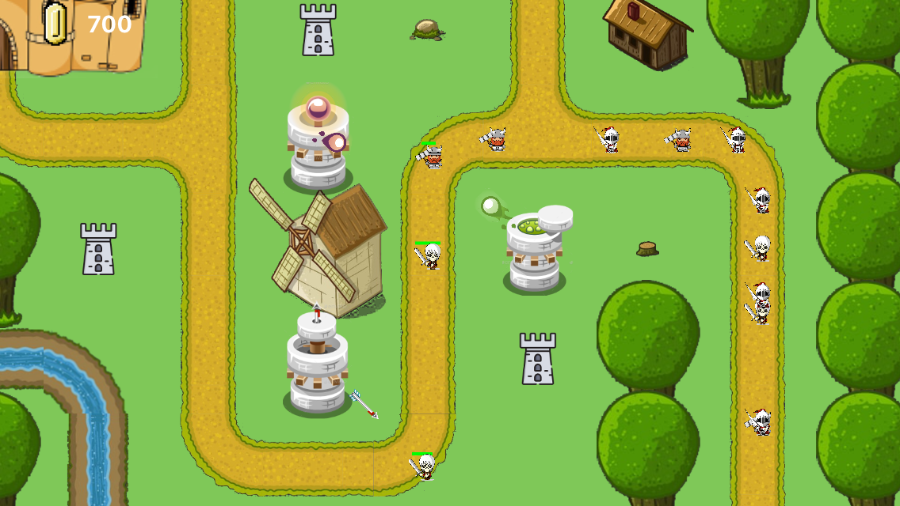
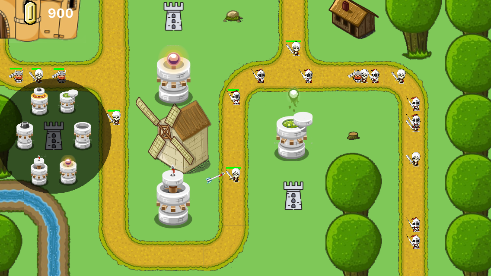
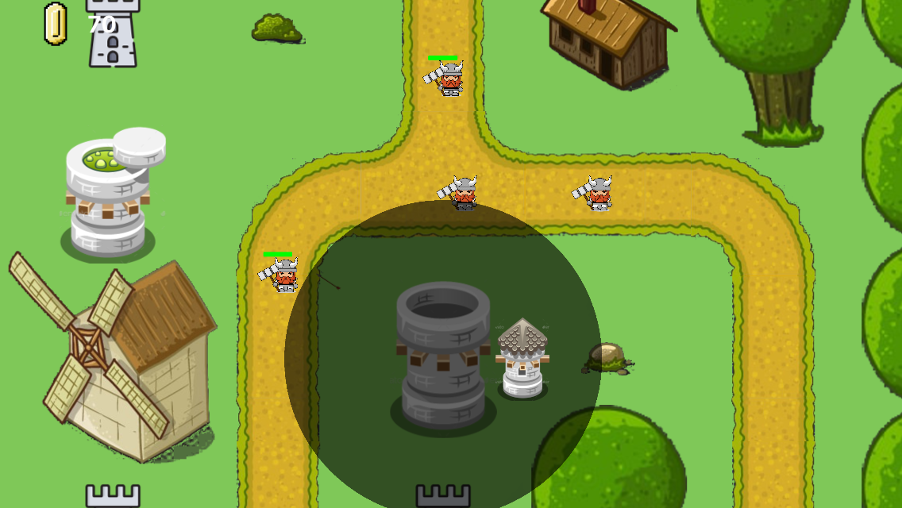

# KingdomDefense

This is a GameplayKit based, Tower Defense type game.
The goal is to survive all coming waves of enemies. Knights, Dwatfs and Undeads can choose different path to reach your castle and crush it. The units have different amount of health, deal different damage with different speed. Dwarfs are very fast but quite simple to defeat, Knights are taugher but also slower but the Undeads are fast and very powerfull.

Survive all waves, do not let the enemy reach your castle and go to the next level!

Build different towers:
- archery,
- toxic,
- ballistic,
- cannon,
- magma,
- plasma.

You can upgrade your towers if you have enough coins.

